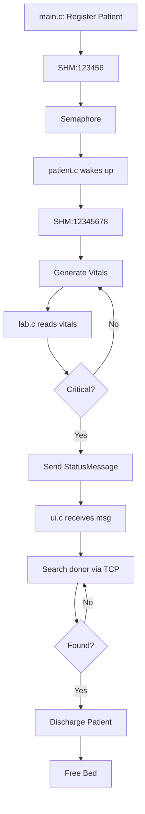

# 🏥 Hospital Management System with Distributed Donor Database


## 📌 Overview
A distributed, multi-process hospital management system that automates:
- Patient registration and bed management
- Real-time vital signs monitoring (up to 5 concurrent patients)
- Laboratory analysis and critical condition detection
- Remote donor database management via TCP sockets
- Automated donor matching and patient discharge workflow
- Web-based dashboards for monitoring vitals and lab results

## ✅ Core Features
- **Distributed Architecture**: Independent donor server accessible via TCP.
- **Real-Time Monitoring**: Multi-threaded vital generation for 5 patients.
- **Critical Care Automation**: Automatic donor search and discharge.
- **Interactive UI**: ncurses-based terminal interface with color coding.
- **Web Dashboards**:
  - Patient Vitals: [http://localhost:8081](http://localhost:8081)
  - Lab Results: [http://localhost:8082](http://localhost:8082)

## 🛠 Technologies Used
- **Language**: C (POSIX-compliant)
- **IPC**: Shared Memory, Message Queues, Semaphores
- **Networking**: TCP Sockets (IPv4)
- **Threading**: POSIX pthreads
- **UI**: ncurses (terminal), HTTP (web)
- **OS**: Linux (Ubuntu/Debian/Fedora/Arch)

## 📂 System Components
- `main.c` – Patient & donor registration
- `patient.c` – Vital signs generator + HTTP dashboard
- `lab.c` – Laboratory analysis & critical detection
- `ui.c` – ncurses-based display interface
- `donor.c` – Remote donor server
- `headers.h` – Common definitions & data structures
- `Makefile` – Build automation
- `main.sh` – Launch script for all components

## 🔄 Workflow


## ⚙️ Installation & Setup
### Prerequisites
```bash
sudo apt-get install build-essential libncurses5-dev libncursesw5-dev
```
### Compile
```bash
make all
```
### Run
```bash
./donor
./patient &
./lab &
./ui &
./main
```
Or use automation:
```bash
./main.sh
```

## 🌐 Access Dashboards
- **Patient Vitals**: [http://localhost:8081](http://localhost:8081)
- **Lab Results**: [http://localhost:8082](http://localhost:8082)

## 🏆 Key Achievements
- Distributed architecture with independent donor server
- Real-time monitoring with multi-threading
- Automated critical care workflow
- Professional ncurses UI + web dashboards
- Efficient IPC coordination (Shared Memory, MsgQ, Semaphores)

## 👥 Contributors
| Name           |
|----------------|
| Aditya Andotra |
| Harsha Vardhan |
| Madhuri V      |
